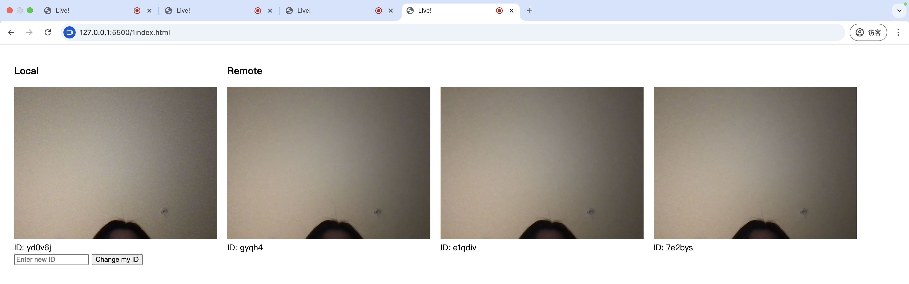

# livestreaming

<!-- 0stream.js
```npm install peerjs``` -->
## usage
Please use files including "1index.html", "1server.js", "1stream.js", and "1style.css".
1. run ```npm install ws``` in terminal
2. run ```node 1server.js``` in terminal
3. open "1index.html"


## future work
1. media source adjustments
2. UI
3. deploy